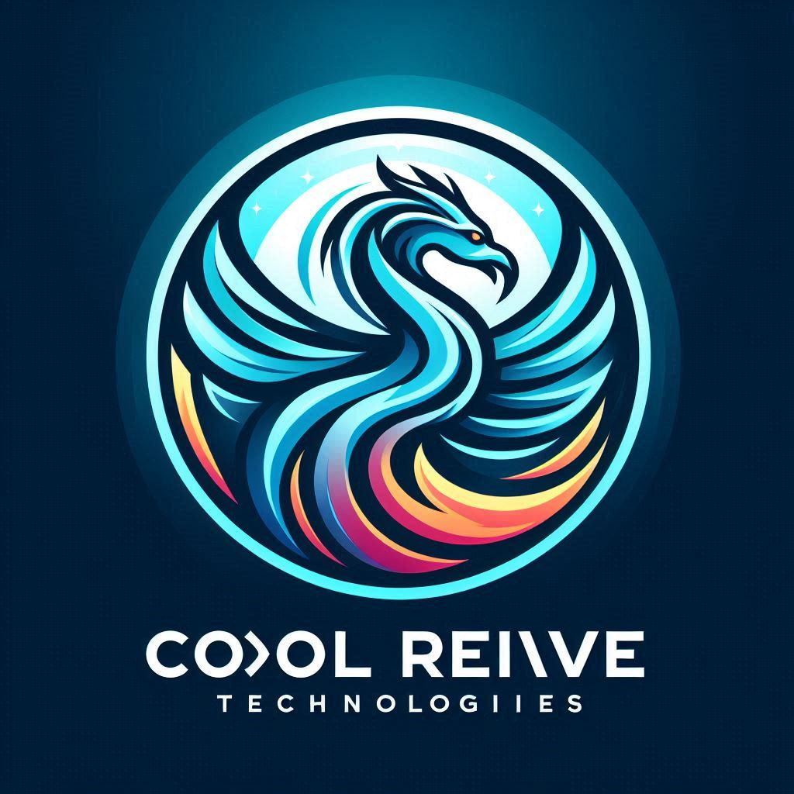

[Building Serverless Solutions with Azure and .NET](https://github.com/TaleLearnCode/BuildingServerlessSolutions) \ [Beer City Code 2024](..\README.md) \ [Background Information](README.md) \

# The Cool Revive Journey: From Frosty Beginnings to Innovation

## Founding Story

In the heart of a snow-covered town, two visionary engineers, Evalyn Frost and Victor Glacier, shared a dream: to revolutionize the world of refrigeration. They believed every appliance deserved a second chance — a chance to be reborn, reimagined, and revived.

In the frosty winter of 2005, they founded the Cool Revive Technologies in a cozy garage. Armed with determination and a toolbox of ideas, they set out to breathe new life into old refrigerators. Their mission? To reduce waste, conserve resources, and create sustainable solutions.

## Early Challenges

Cool Revive faced its fair share of challenges. The prototype - an ice-blue retro fridge - was a labor of love. Evelyn and Victor worked late into the night, soldering wires, recalibrating thermostats, and whispering encouragement to the stubborn compressor. But they knew they were onto something special when the fridge hummed to life.

## The Breakthrough

Word spread like frost on a windowpane. Cool Revive's innovative approach caught the attention of local repair shops, environmentalists, and even a curious penguin named Percy (who happened to waddle by during a demo). The breakthrough? A patented "ChillCycle" algorithm that optimizes cooling efficiency while minimizing energy consumption.

## The Cool Revive Manifesto

1. **Refrigerators Deserve Resurrection**: Cool Revive vowed to rescue refrigerators abandoned in scrapyards, basements, and forgotten kitchen corners.
2. **Eco-Friendly Overhaul**: Each unit underwent a meticulous transformation — new insulation, upgraded compressors, and eco-friendly refrigerants.
3. **Art Meets Appliance**: Cool Revive turned fridges into canvases. Customers could choose custom designs - from icy landscapes to funky abstracts.
4. **Community Cool-Offs**: Cool Revive hosted "Cool-Off" events, where neighbors gathered to swap fridge stories, sup cocoa, and marvel at repurposed iceboxes.

## The Cool Revive Legacy

Today, Cool Revive Technologies stands tall, emphasized by its logo, the phoenix. Their refrigerators grace trendy cafes, cozy cabins, and eco-conscious homes. Evelyn and Victor, now grandparents, are still tinkering in the workshop, passing down their passion to the next generation.

So next time you open your Cool Revive fridge, remember: It's now just a place for leftovers; it's a piece of history - a frosty tale of resilience, reinvention, and the art of keeping things cool.

