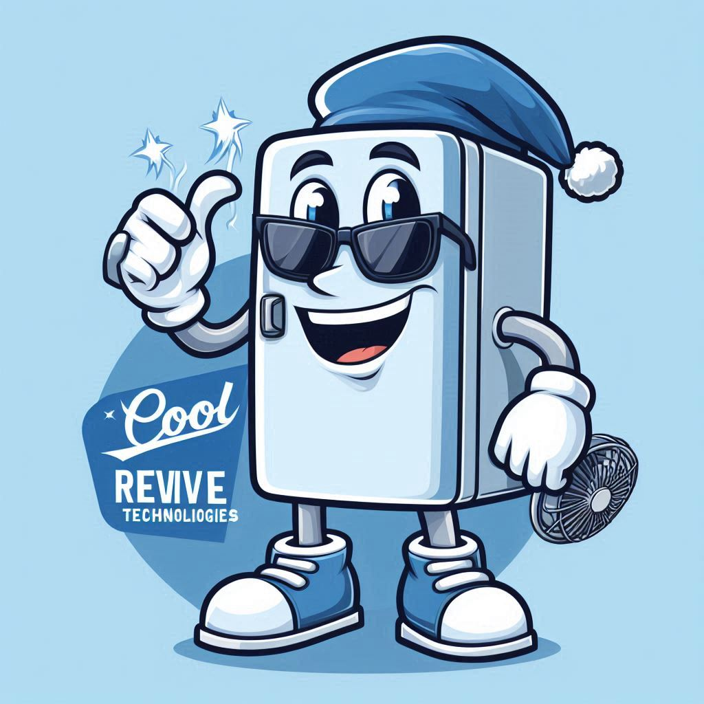

[Building Serverless Solutions with Azure and .NET](https://github.com/TaleLearnCode/BuildingServerlessSolutions) \ [Beer City Code 2024](..\README.md) \ [Background Information](README.md) \

# Frosty the Fridge

Frosty is a vintage refrigerator with a retro twist. His body is a cool glacier blue adorned with whimsical snowflake decals. His door handles resemble icicles, and his freezer compartment doubles as a cozy hat.

Frosty is the ultimate optimist. Despite his chilly exterior, he radiates warmth and kindness. He loves telling frosty jokes (pun intended) and making people smile. Frosty's motto: "Keep it cool, but always stay warm-hearted."

Frosty has important roles at Cool Revive. He greets visitors at the Cool Revive showroom, offering them frosty high-fives. He is the unofficial tour guide, showing off the refurbished fridges and sharing their unique stories. And during community events, Frosty hosts ice cream socials (with eco-friendly, locally sourced ice cream, of course).

So, next time you visit Cool Revive, say hello to Frosty—he's the coolest (literally) mascot in town!❄️🥶

