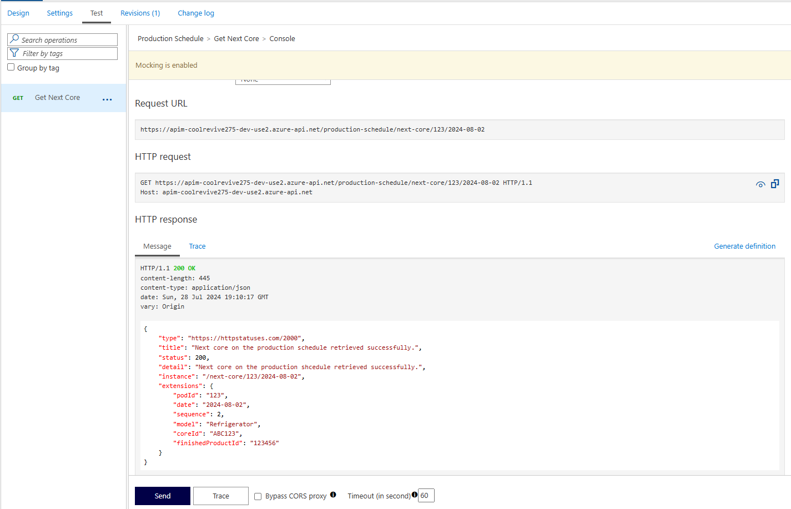

[Building Serverless Solutions with Azure and .NET](https://github.com/TaleLearnCode/BuildingServerlessSolutions) \ [Beer City Code 2024](..\README.md) \ [Labs](README.md) \

# Lab 2: Mock Production Schedule Endpoint

## Introduction

The Production Schedule system at Cool Revive Technologies is a critical component responsible for orchestrating the daily remanufacturing activities. This system determines the schedule for each production pod, specifying which refrigerator cores are to be remanufactured throughout the day. By analyzing various factors such as inventory levels, demand forecasts, and production capacity, the Production Schedule system ensures an efficient and balanced workflow.

For the purposes of the **Build Serverless Solutions with Azure and .NET** workshop, we will not build this system that the Remanufacturing system is dependent on but is an independent, external system. Instead, we will create a simulation to interact with it, enabling the seamless progression of the remanufacturing process.

## Objective

This lab exercise aims to enable attendees to create a mocked API endpoint using Azure API Management. This mocked endpoint will simulate the Production Schedule endpoints that have yet to be developed. By the end of this lab, participants will:

- Learn how to set up and configure a new API in Azure API Management.
- Create a mocked API endpoint to simulate real-world production scenarios.
- Test the mocked API endpoint to ensure it behaves as expected.
- Gain practical experience that can be applied to future API development and management tasks.

## Azure Services Descriptions

In this lab, you will interact with the Azure API Management service instance created during [Lab 0 (Initialize Environment)](00-initialize-environment.md). Azure API Management is a fully managed service that helps organizations publish APIs to external, partner, and internal developers. Here are some key aspects:

### Key Components

- **API Gateway**: This acts as a facade to the backend services, handling all client application requests and forwarding them to the appropriate backend services. It enables consistent routing, security, throttling, caching, and observability configuration.
- **Management Plane**: Provides tools for managing APIs, including creating, publishing, securing, and analyzing APIs.
- **Developer Portal**: A customizable portal where developers can discover, learn about, and consumer APIs. It includes API documentation, interactive API consoles, and subscription management.

### Features

- **API Mocking**: Allows you to create mock responses for APIs that are still under development, enabling front-end and back-end teams to work in parallel.
- **Security**: Provides various security features such as authentication, authorization, IP filtering, and rate limiting to protect your APIs.
- **Analytics**: Offers insights into API usage, performance, and health, helping you make data-driven decisions.
- **Versioning and Revisions**: Supports API versioning and revisions, allowing you to manage changes and updates to your APIs without disrupting consumers.
- **Integration**: Easily integrates with other Azure services and third-party tools, enhancing the overall API ecosystem.

### Use Cases

- **Legacy Modernization**: Abstracts and modernizes legacy backends, making them accessible from new cloud services and modern applications.
- **Multi-Channel User Experiences**: Enables APIs to support web, mobile, wearable, or IoT applications, accelerating development and ROI.
- **B2B Integration**: Lowers the barrier to integrating business processes and exchanging data between business entities through APIs.

Azure API Management is a powerful tool for managing the entire lifecycle of your APIs, from creation and deployment to monitoring and security.

## Steps

### Section 0: Navigate to the API Management instance

1. From the [Azure Portal](https://portal.azure.com), search for `apim-CoolRevive` and select the appropriate API Management instance.

### Section 1: Create a Product

To publish the API we are about to create, you need a product within API Management. Products let you group APIs and define terms of use and runtime policies. API consumers can subscribe to a product to obtain a key to call the APIs within the product.

1. In the left-hand menu, select **APIs** > **Products**.

2. Click the **+ Add** button.

3. Provide the following values:

   | Field                 | Value                                                        |
   | --------------------- | ------------------------------------------------------------ |
   | Display Name          | Production Schedule                                          |
   | Id                    | production-schedule                                          |
   | Description           | Provides the ability to interact with the Production Schedule system. |
   | Published             | Checked                                                      |
   | Requires subscription | Checked                                                      |
   | Requires approve      | Unchecked                                                    |

4. Click the **Create** button.

### Section 2: Create a New API

1. In the left-hand menu, select **APIs** > **APIs**.

2. On the **Define a new API** page, click on **HTTP**, which will allow you to define an HTTP API manually.

3. On the **Create an HTTP API** dialog, select **Full** and then fill in the fields as specified below

   | Field             | Value                                                        |
   | ----------------- | ------------------------------------------------------------ |
   | Display name      | Production Schedule                                          |
   | Name              | production-schedule                                          |
   | Description       | Provides endpoints to interact with the Production Schedule system. |
   | API URL suffix    | production-schedule                                          |
   | Products          | Production Schedule                                          |
   | Gateways          | Managed                                                      |
   | Version this API? | Unchecked                                                    |

4. Click the **Create** button.

### Section 3: Define the Mocked Endpoint

1. In the API settings, click on **+ Add Operation**.

2. Fill in the details for the operation:

   | Field             | Value                                                        |
   | ----------------- | ------------------------------------------------------------ |
   | Display name      | Get Next Core                                                |
   | Name              | get-next-core                                                |
   | URL (HTTP Method) | GET                                                          |
   | URL               | next-core/{podId}/{date}                                     |
   | Description       | Retrieves the next core to be remanufactured for the specified pod. |

3. In the Template parameters, specify the following values:
   | Name      | Description                                   | Type   | Value      |
   | --------- | --------------------------------------------- | ------ | ---------- |
   | **podId** | Identifier of the pod to query for.           | string | 123        |
   | **date**  | The date to query in ISO format (yyyy-mm-dd). | date   | 2024-08-02 |

4. Click on the **Responses** tab.

5. Click on **+ Add response** and select `200 OK`

6. In the **Description** field enter:

   ```
   If the pod is found and there are cores left to build for the specified date, the API will return the details of the next core to be remanufactured.
   ```

7. Click the **+ Add representation** button and select `application/json`

   > [!Tip]
   >
   > The `application/json` option will not initially appear in the drop-down list. Type in the name and it will appear.

8. In the **SAMPLE** field, specify the following JSON:

   ```json
   {
       "ResponseType": 1,
       "Type": "https://httpstatuses.com/200",
       "Title": "GetNextCore operation successful.",
       "Status": 200,
       "Detail": "Next core on the production schedule retrieved successfully.",
       "Instance": "/next-core/123/2024-08-02",
       "Extensions": 
       {
           "PodId": "Pod123",
           "Date": "2024-08-02",
           "Sequence": 2,
           "Model": "Refrigerator",
           "CoreId": "Core123",
           "FinishedProductId": "FinishedProduct123"
       }
   }
   ```

9. Click the **Save** button.

### Section  4: Enable response mocking

1. Assuming that you are on the **Design** tab with the **Get Next Core** operation selected, click the **+ Add policy** button in the **Inbound processing** window.

2. Select **Mock responses** from the gallery.

3. In the **API Management response** textbox, type **200 OK, application/json**. This selection indicates that your API should return the response sample you defined in the previous section.

   > [!NOTE]
   >
   > The **200, OK, application/json** selection should be populated by default in the **API Management response** field.

4. Click the **Save** button.

> [!TIP]
>
> A yellow bar with the text **Mocking is enabled** is displayed. This indicates that the mocking policy mocks the responses returned from API Management and is not produced by the backend.

### Section  5: Test the Mocked API Endpoint

1. Select the **Test** tab.
2. Ensure that the `Get Next Core` operation is selected.
3. Click the **Send** button.
4. The **Http response** displays the JSON provided as a sample in the previous section.



### Section 6: Create a Subscription

As part of the security measures for API operations within API Management, you must supply a subscription key when calling the API endpoints.

1. From the left-hand menu, select **APIs** > **Subscriptions**.

2. Click the **+ Add subscription** button and supply the following values in the **New subscription** dialog:

   | Field         | Value           |
   | ------------- | --------------- |
   | Name          | Remanufacturing |
   | Display name  | Remanufacturing |
   | Allow tracing | Unchecked       |
   | Scope         | All APIs        |
   | User          | Administrator   |

   > [!CAUTION]
   >
   > Several values here are for workshop purposes only, and you would not want to set them like this in real-world scenarios:
   >
   > - The Scope should be limited to provide the least privileges; in other words, only provide access to the APIs or Products the user needs.
   > - You should not use the Administrator account to grant access to APIs. We do this because two API Management users cannot have the same email address. In a real-world scenario, the administrator account would use an alias or shared email address. The user accounts could also be set up this way, as they might represent systems or components. Remember that if you are using shared email addresses, the password on that email account should change whenever someone with access to the account leaves or is reassigned.

3. Click the **Create** button.

## Conclusion

In this lab exercise, you have successfully created a mocked API endpoint using Azure API Management to simulate the Production Schedule endpoints. By completing this exercise, you have:

- Gained an understanding of Azure API Management and its key features.
- Learned how to set up and configure a new API in Azure API Management.
- Created and configured a mocked API endpoint to simulate real-world production scenarios.
- Tested the mocked API endpoint to ensure it behaves as expected.

These skills are essential for managing the lifecycle of APIs, enabling you to develop, test, and deploy APIs efficiently. You can now apply these techniques to other projects, ensuring your API development process is robust and well-structured.

## Next Steps

In the next lab exercise, you will build an Azure Function triggered from the `sbt-GetNextCore` Service Bus topic to retrieve the necessary information from the Production Schedule system using the mocked API operation you created in this lab exercise.